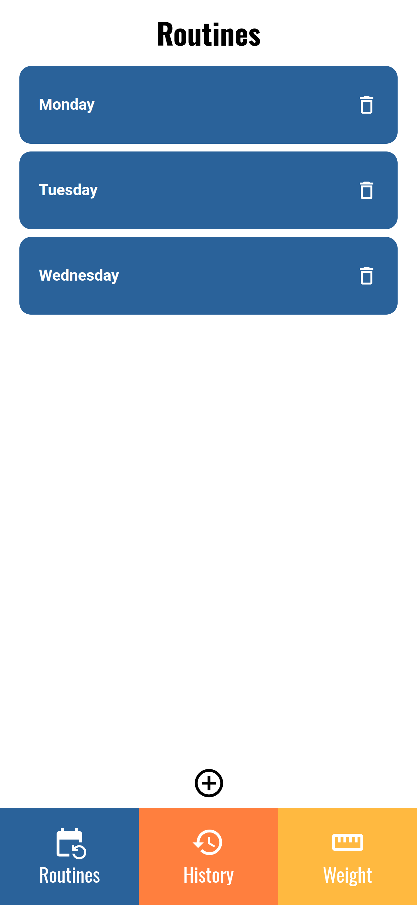

# GymTracker

A modern, full-stack gym tracking app built with React, Vite, TypeScript, Material UI, Tailwind CSS, Django REST API, and React Query.

## Features

- **Routines**: Create, view, and manage your workout routines.
- **Exercises**: Add, edit, and track exercises for each routine.
- **History**: View your workout history by day or month.
- **Weight**: Log and visualize your weight progress over time.
- **Responsive UI**: Built with Material UI and Tailwind CSS for a clean, modern look.
- **Fast & Reliable**: Powered by Vite, React Query, and Django REST API.

---

## Screenshots

### Routines



### Exercises


### History


### Weight


---

## Getting Started

### Prerequisites

- Node.js 18+
- Python 3.10+

### Install & Run (Frontend)

```bash
cd react-gymtracker
npm install
npm run dev
```

### Install & Run (Backend)

```bash
cd django-gymtracker
pip install -r requirements.txt
python manage.py migrate
python manage.py runserver
```

---

## Tech Stack

- **Frontend**: React, Vite, TypeScript, Material UI, Tailwind CSS, React Query
- **Backend**: Django, Django REST Framework
- **Charts**: @mui/x-charts

---

## Folder Structure

```text
react-gymtracker/
  src/
    components/
    routes/
    services/
  public/
    screenshots/
  ...
django-gymtracker/
  workouts/
  ...
```

---

## Contributing

Pull requests are welcome! For major changes, please open an issue first to discuss what you would like to change.

---

## License

[MIT](LICENSE)

---

## Acknowledgements

- [React](https://react.dev/)
- [Vite](https://vitejs.dev/)
- [Material UI](https://mui.com/)
- [Tailwind CSS](https://tailwindcss.com/)
- [Django](https://www.djangoproject.com/)
- [React Query](https://tanstack.com/query/latest)
- [MUI X Charts](https://mui.com/x/react-charts/)

---
